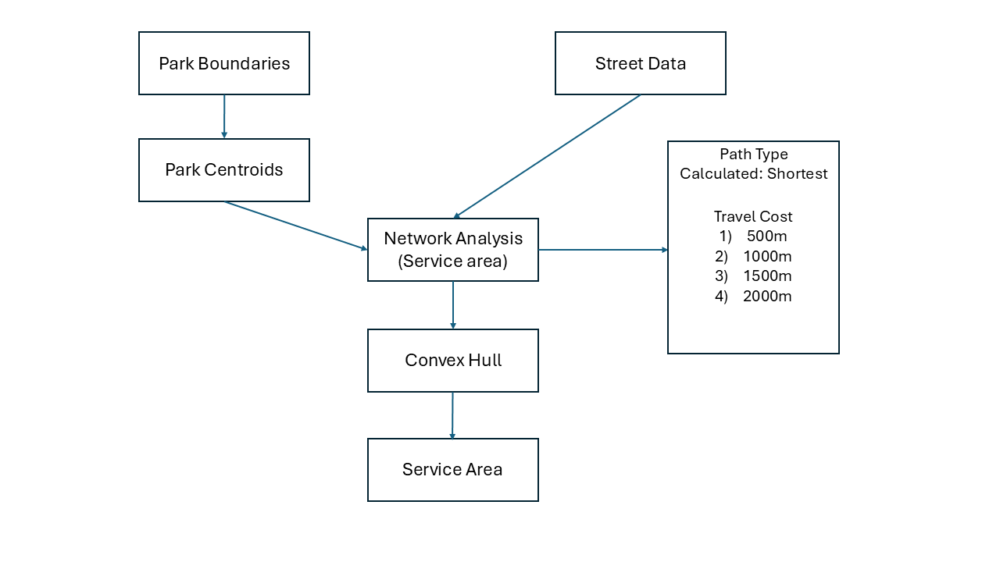

# Mapping Walkable Access to Parks in Lexington, Kentucky
The final project assesses the walking accessibility of parks in Lexington using walkable service areas based on the closest street network distances. By creating isochrones at 500m, 1000m, 1500m, and 2000m intervals, the project delineates the extent of walkable service areas of the parks to the residents of Lexington. Areas more than 2000m distances are classified as underserved areas meaning these areas have limited walking accessibilty to parks.
The need for such work stems from the critical role urban parks play in well being of its residents. Through this work, I tried to show that although there are plenty of parks in the  Lexington, these are disproportionately arranged which results in spatial inequalities in park access.

## Project Contents
Following are the list of contents for the project
- [Data Source](#data-source)
- [Work Flow](#work-flow)
- [Results](#results)
- [Final Project Link](#final-project-link)

### Data Source
* [Lexington Park Data](https://data.lexingtonky.gov/datasets/764044274e974dbba9069d9dab7dcb34_0/explore?location=38.028560%2C-84.466742%2C10.42)

The data contains Boundaries of city and state maintained parks within Lexington-Fayette County, Kentucky.

* [Lexington Street Data](https://data.lexingtonky.gov/datasets/b0388c01870149c3987790659ac0b37f_0/explore?location=38.027384%2C-84.472968%2C9.54)

The street centerline data contains address ranges, maintenance responsibility, road classification, speed limits, and more.

* [Lexington Shapefile](https://www.census.gov/cgi-bin/geo/shapefiles/index.php)

The data contains the shapefile of Fayette county, Kentucky.

### Work Flow
QGIS was used to complete the entire project from the scratch.

#### Data Preparation
 ***Park Boundaries:*** The project began by loading  the shapefile containing the boundaries of parks within the study area.

***Park Centroids:*** Using QGIS's "Centroid" tool, the geometric center of each park polygon is extracted to serve as the reference point for accessibility analysis.

***Street Data:*** The street dataset was loaded into QGIS. This dataset represents the walkable paths within the study area and is necessary for conducting network-based distance calculations.

***Projection:*** NAD 83/ UTM Zone 16 projection was used and all of the data were converted to this projection to ensure spatial accuracy and proper alignment of layers.

#### Service Area Generation
The Network Analysis (Service Area) tool in QGIS is used to determine the areas that can be reached within a specified distance along a street network. Unlike simple buffer analysis, this tool calculates accessibility by considering the actual road network structure.

In this project, the tool was used to assess pedestrian access to parks by computing the shortest distances from each park centroid along the street network. The analysis was conducted using four distance thresholds: 500m, 1000m, 1500m, and 2000m, representing typical walkable distances. The key parameters used in the tool included defining the travel cost as distance (meters) and setting the path type to "shortest," to make sure that the calculated service areas reflect the most efficient walking routes.

The service areas generated appeared fragmented due to the irregular structure of the street network. To address this, the Convex Hull tool in QGIS was applied to create a simplified boundary that encloses the entire accessible area for each distance threshold. A convex hull is a minimum bounding polygon that wraps around a set of features. Using convex hull ensured that the service areas are represented as continuous, unified zones rather than disconnected street segments.

#### Map Visualization
Two panel Mapping structure was followed to visualize the output of the project. One map displays the street network color-coded by distance thresholds from park locations, helping to visualize shortest street connectivity from park centroids. The other one represents the actual service areas of parks by applying a convex hull approach to generate polygons that enclose walkable zones.

For the background, Carto Dark Matter(no label) tiles was used, which enhances contrast and makes the color-coded walkability zones stand out clearly. The park locations are marked with small purple dots which ensures better visibility and reduces visual clutter. The use of gradual color transitions from green to red helps communicate accessibility levels more effectively.

### Results

The output indicates that concentration of walkable access to parks are present at the city's core regions, while the peripheral regions have limited access to parks. The purpose of the study is to show the spatial inequality that exist in the city of lexington in terms of walking accessibility to parks.

### Final Project Link

The full map can be viewed using the following link 
[Index Page](https://kmnafee.github.io/Mapping-Walkable-Access-to-Parks)
